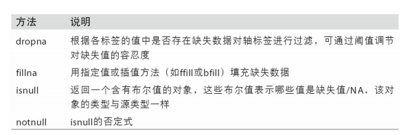
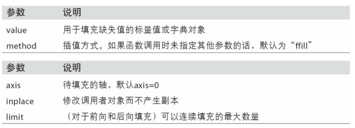
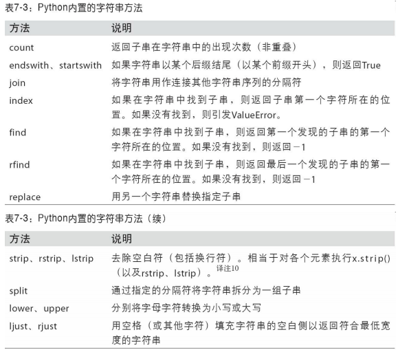
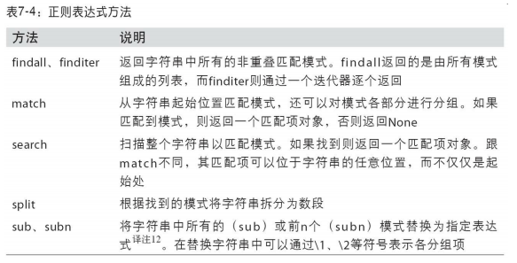
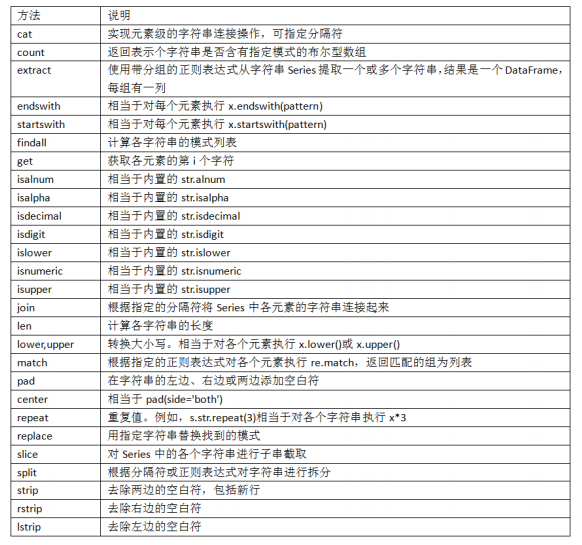

# 数据清洗和准备

## 处理缺失数据

  - 对于数值数据，pandas使用浮点值NaN（Not a Number）表示缺失数据。
  - 缺失数据处理的函数：
  
    
    
  - 滤除缺失数据：
    - 对于一个Series，dropna返回一个仅含非空数据和索引值的Series。
    - dropna默认丢弃任何含有缺失值的行。传入how='all'将只丢弃全为NA的那些行。用这种方式丢弃列，只需传入axis=1即可。
  - 填充缺失数据：
    - fillna方法是最主要的填充缺失数据的函数。通过一个常数调用fillna就会将缺失值替换为那个常数值。
    - 通过一个字典调用fillna，就可以实现对不同的列填充不同的值。
      ```
      df.fillna({1:0.5, 2:0.6})
      ```
    - fillna默认会返回新对象，但也可以通过设置inplace=True对现有对象进行就地修改。
    - fillna的参数：
    
      
  
## 数据转换

  - 移除重复数据：
    - DataFrame的duplicated方法返回一个布尔型Series，表示各行是否是重复行。
    - drop_duplicates方法，它会返回一个DataFrame，重复的数组会标为False。
    - 这两个方法默认会判断全部列，你也可以指定部分列进行重复项判断。它们默认保留的是第一个出现的值组合。传入keep='last'则保留最后一个。
  - 利用函数或映射进行数据转换：
    - 使用map是一种实现元素级转换以及其他数据清理工作的便捷方式。
  - 替换值：
    - replace则提供了一种实现替换值的更简单、更灵活的方式。如果一次性替换多个值，可以传入一个由待替换值组成的列表以及一个替换值。传入的参数也可以是字典。
  - 重命名轴索引：
    - rename可以结合字典型对象实现对部分轴标签的更新，实现复制DataFrame并对其索引和列标签进行赋值。如果希望就地修改某个数据集，传入inplace=True即可。
      ```
      data.rename(index={'OHIO': 'INDIANA'}, inplace=True)
      ```
  - 离散化和面元划分：
    - 为了便于分析，连续数据常常被离散化或拆分为“面元”（bin）。要实现该功能，需要使用pandas的cut函数。
      ```
      bins =  [18, 25, 35, 60, 100]
      cats = pd.cut(ages, bins)
      ```
    - 通过传递一个列表或数组到labels，可以设置自己的面元名称。
    - 如果向cut传入的是面元的数量而不是确切的面元边界，则它会根据数据的最小值和最大值计算等长面元。
      ```
      data = np.random.rand(20)
      pd.cut(data, 4, precision=2)
      ```
    - qcut是一个非常类似于cut的函数，它可以根据样本分位数对数据进行面元划分。可以得到大小基本相等的面元。
      ```
      data = np.random.randn(1000)
      cats = pd.qcut(data, 4)
      ```
  - 检测和过滤异常值：
    - 过滤或变换异常值（outlier）在很大程度上就是运用数组运算。
  - 排列和随机采样：
    - 利用numpy.random.permutation函数可以轻松实现对Series或DataFrame的列的排列工作（permuting，随机重排序）。
    - 如果不想用替换的方式选取随机子集，可以在Series和DataFrame上使用sample方法。要通过替换的方式产生样本（允许重复选择），可以传递replace=True到sample。
  - 计算指标/哑变量：
    - 另一种常用于统计建模或机器学习的转换方式是：将分类变量（categorical variable）转换为“哑变量”或“指标矩阵”。
    - pandas有一个get_dummies函数可以实现该功能。想给指标DataFrame的列加上一个前缀，以便能够跟其他数据进行合并。get_dummies的prefix参数可以实现该功能。
    
## 字符串操作

  - 字符串对象方法：
    - Python内置的字符串方法：
    
      
      
  - 正则表达式：
    - 正则表达式提供了一种灵活的在文本中搜索或匹配字符串模式的方式。正则表达式，常称作regex，是根据正则表达式语言编写的字符串。
    - Python内置的re模块负责对字符串应用正则表达式。re模块的函数可以分为三个大类：模式匹配、替换以及拆分。
    - 正则表达式方法：
    
      
      
  - pandas字符串方法：
    
    
  
