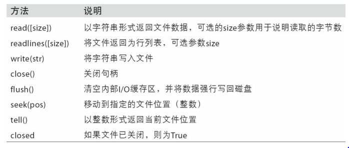

# Python的数据结构、函数和文件

  - Python最基础的数据结构包括：元组、列表、字典和集合。
  
## 数据结构和序列

  - 元组：一个固定长度，不可改变的Python序列对象。
    - 用tuple可以将任意序列或迭代器转换成元组。
    - 可以用方括号访问元组中的元素，序列是从0开始的。
    - 元组中存储的对象可能是可变对象。一旦创建了元组，元组中的对象就不能修改了。
    - 可以用加号运算符将元组串联起来。
    - 元组乘以一个整数，像列表一样，会将几个元组的复制串联起来。
    - 替换变量：
      ```
      a, b = 1, 2
      b, a = a, b
      ```
    - tuple方法：count（也适用于列表），它可以统计某个值得出现频率。
  - 列表：
    - 列表的长度可变、内容可以被修改。你可以用方括号定义，或用list函数。
    - 添加和删除元素：
      - 可以用append在列表末尾添加元素。
      - insert可以在特定的位置插入元素。插入的序号必须在0和列表长度之间。
      - insert的逆运算是pop，它移除并返回指定位置的元素。
      - 可以用remove去除某个值，remove会先寻找第一个值并除去。
    - 用in可以检查列表是否包含某个值，否定in可以再加一个not。
      - 语法：
        ```
        'cn' in cn_list
        'cn' not in ab_list
        ```
    - 串联和组合列表：
      - 与元组类似，可以用加号将两个列表串联起来。
      - 如果已经定义了一个列表，用extend方法可以追加多个元素。
    - 排序：
      - 可以用sort函数将一个列表原地排序（不创建新的对象）。
      - sort有一些选项，其中之一是二级排序key，可以用这个key进行排序。
        - 例子：按长度对字符串进行排序
          ```
          b = ['saw', 'small', 'He', 'foxes', 'six']
          b.sort(key=len)
          ```
    - 二分搜索和维护已排序的列表:
      - bisect模块支持二分查找，和向已排序的列表插入值。bisect.bisect可以找到插入值后仍保证排序的位置，bisect.insort是向这个位置插入值。
      - bisect模块不会检查列表是否已排好序，进行检查的话会耗费大量计算。因此，对未排序的列表使用bisect不会产生错误，但结果不一定正确。
    - 切片：
      - 用切边可以选取大多数序列类型的一部分，切片的基本形式是在方括号中使用start:stop。
      - 切片的起始元素是包括的，不包含结束元素。结果中包含的元素个数是stop - start。
      - 负数表明从后向前切片。
      - 例子：
        ```
        seq[::2] #在第二个冒号后面使用step，可以隔一个取一个元素
        seq[::-1] #将列表或元组颠倒过来 
        ```
  - 序列函数:
    - enumerate函数：可以返回(i, value)元组序列。
      - 索引数据时，使用enumerate的一个好方法是计算序列（唯一的）dict映射到位置的值。
      - 语法：
        ```
        mapping = {}
        for i, v in enumerate(some_list):
          mapping[v] = i
        ```
    - sorted函数：
      - 从任意序列的元素返回一个新的排好序的列表。
      - sorted函数可以接受和sort相同的参数。
    - zip函数：
      - zip可以将多个列表、元组或其它序列成对组合成一个元组列表。
      - zip可以处理任意多的序列，元素的个数取决于最短的序列。
    - reversed函数：
      - reversed可以从后向前迭代一个序列。
      - reversed是一个生成器，只有实体化（即列表或for循环）之后才能创建翻转的序列。
  - 字典：
    - 键值对的大小可变集合，键和值都是Python对象。
    - 语法：
      ```
      empty_dict = {}
      d1 = {'a' : 'cn', 'b' : 'cn2'}
      ```
    - 用in检查字典中是否包含某个键：'b' in d1
    - 可以用del关键字或pop方法（返回值的同时删除键）删除值。
    - keys和values是字典的键和值的迭代器方法。虽然键值对没有顺序，这两个方法可以用相同的顺序输出键和值。
    - 用update方法可以将一个字典与另一个融合，update方法是原地改变字典，因此任何传递给update的键的旧的值都会被舍弃。
    - 用序列创建字典：
      ```
      mapping = {}
      for key, value in zip(key_list, value_list):
        mapping[key] = value
      ```
    - dict的方法get和pop可以取默认值进行返回：
      ```
      value = some_dict.get(key, default_value)
      ```
    - 有效的键类型：
      - 字典的值可以是任意Python对象，而键通常是不可变的标量类型（整数、浮点型、字符串）或元组（元组中的对象必须是不可变的）。这被称为“可哈希性”。
可以用hash函数检测一个对象是否是可哈希的（可被用作字典的键）。
  - 集合：
    - 集合是无序的不可重复的元素的集合。你可以把它当做字典，但是只有键没有值。
    - 可以用两种方式创建集合：通过set函数或使用尖括号set语句。
      ```
      set([2, 2, 2, 1, 3, 3])
      {2, 2, 2, 1, 3, 3}
      ```
    - 集合支持合并、交集、差分和对称差等数学集合运算。
      
      
      
  - 列表、集合和字典推导式：
    - 列表推导式：
      - 允许用户方便的从一个集合过滤元素，形成列表，在传递参数的过程中还可以修改元素。
      - 语法：[expr for val in collection if condition]
    - 集合的推导式：
      - 语法：set_comp = {expr for value in collection if condition}
    - 字典的推导式：
      - 语法：dict_comp = {key-expr : value-expr for value in collection if condition}
      
## 函数

  - 如果你要重复使用相同或非常类似的代码，就需要写一个函数。通过给函数起一个名字，还可以提高代码的可读性。
  - 函数使用def关键字声明，用return关键字返回值。
  - 同时拥有多条return语句也是可以的。如果到达函数末尾时没有遇到任何一条return语句，则返回None。
  - 函数可以有一些位置参数（positional）和一些关键字参数（keyword）。关键字参数通常用于指定默认值或可选参数。关键字参数必须位于位置参数（如果有的话）之后。
    
### 命名空间、作用域，和局部函数

  - 函数可以访问两种不同作用域中的变量：全局（global）和局部（local）。
  - 任何在函数中赋值的变量默认都是被分配到局部命名空间（local namespace）中的。局部命名空间是在函数被调用时创建的，函数参数会立即填入该命名空间。在函数执行完毕之后，局部命名空间就会被销毁。
  - 全局变量用global关键字声明。建议不要频繁使用global关键字。因为全局变量一般是用于存放系统的某些状态的。
  - 匿名（lambda）函数：
    - 仅由单条语句组成，该语句的结果就是返回值。它是通过lambda关键字定义的。
    - 语法：equiv_anon = lambda x: x * 2
  - 柯里化：部分参数应用：
    - 柯里化（currying）指的是通过“部分参数应用”（partial argument application）从现有函数派生出新函数的技术。
    - 其实就只是定义了一个可以调用现有函数的新函数而已。内置的functools模块可以用partial函数将此过程简化：
      ```
      from functools import partial
      add_five = partial(add_numbers, 5)
      ```
  - 生成器：
    - 能以一种一致的方式对序列进行迭代（比如列表中的对象或文件中的行）是Python的一个重要特点。
    - 生成器（generator）是构造新的可迭代对象的一种简单方式。一般的函数执行之后只会返回单个值，而生成器则是以延迟的方式返回一个值序列，即每返回一个值之后暂停，直到下一个值被请求时再继续。
    - 要创建一个生成器，只需将函数中的return替换为yeild即可：
      ```
      def squares(n=10):
        for i in range(1, n + 1):
          yield i ** 2
      ```
    - 生成器表达式：
      ```
      gen = (x ** 2 for x in range(100))
      ```
    - itertools模块：
    
      
      
    - 错误和异常处理：使用try, except, finally等关键字。
    
## 文件和操作系统

  - 打开一个文件以便读写，可以使用内置的open函数以及一个相对或绝对的文件路径。
    ```
    path = 'some/path'
    f = open(path)
    for line in f:
      pass
    ```
  - 默认情况下，文件是以只读模式（'r'）打开的。
  - 如果使用open创建文件对象，一定要用close关闭它。关闭文件可以返回操作系统资源。
  - 用with语句可以可以更容易地清理打开的文件，因为它在退出代码块时，自动关闭文件。
    ```
    with open(path) as f:
      lines = [x.rstrip() for x in f]
    ```
  - 读写模式:
  
    
    
  - 常用的文件方法：
  
    
    
  - 文件的字节和Unicode：
    - Python文件的默认操作是“文本模式”，它与“二进制模式”相对，文件模式加一个b。
    - UTF-8是长度可变的Unicode编码，从文件请求一定数量的字符时，Python会从文件读取足够多（可能少至10或多至40字节）的字节进行解码。如果以“rb”模式打开文件，则读取确切的请求字节数。
    
