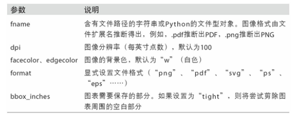

# 绘图和可视化

## matplotlib API入门

  - matplotlib的通常引入约定是：import matplotlib.pyplot as plt.
  - Figure和Subplot：
    - matplotlib的图像都位于Figure对象中。可以用plt.figure创建一个新的Figure。
    - 不能通过空Figure绘图。必须用add_subplot创建一个或多个subplot才行。
      ```
      fig = plt.figure()
      ax1 = fig.add_subplot(2, 2, 1)
      ```
    - matplotlib有一个更为方便的方法plt.subplots，它可以创建一个新的Figure，并返回一个含有已创建的subplot对象的NumPy数组。
    - subplot常用参数：
      
      
      
    - 调整subplot周围的间距：利用Figure的subplots_adjust方法可以轻而易举地修改间距。
    - 颜色、标记和线型：
      ```
      ax.plot(x, y, 'g--')
      ax.plot(x, y, linestyle='--', color='g')
      ```
    - 刻度、标签和图例：pyplot接口的设计目的就是交互式使用，含有xlim、xticks和xticklabels之类的方法。它们分别控制图表的范围、刻度位置、刻度标签等。
    - 设置标题、轴标签、刻度以及刻度标签：要改变x轴刻度，最简单的办法是使用set_xticks和set_xticklabels。rotation选项设定x刻度标签倾斜度。最后，再用set_xlabel为X轴设置一个名称，并用set_title设置一个标题。
    - 添加图例：图例（legend）是另一种用于标识图表元素的重要工具。
    - 注解以及在Subplot上绘图：注解和文字可以通过text、arrow和annotate函数进行添加。ax.annotate方法可以在指定的x和y坐标轴绘制标签。
    - 将图表保存到文件：利用plt.savefig可以将当前图表保存到文件。该方法相当于Figure对象的实例方法savefig。
      ```
      plt.savefig('f1.svg')
      ```
      
      
  - matplotlib配置：
    - 几乎所有默认行为都能通过一组全局参数进行自定义，它们可以管理图像大小、subplot边距、配色方案、字体大小、网格类型等。一种Python编程方式配置系统的方法是使用rc方法。
    
## 使用pandas和seaborn绘图

  - 线型图：
    
    
    
    
    
  - 柱状图：
    - plot.bar()和plot.barh()分别绘制水平和垂直的柱状图。这时，Series和DataFrame的索引将会被用作X（bar）或Y（barh）刻度。
  - 直方图和密度图：
    - 直方图（histogram）是一种可以对值频率进行离散化显示的柱状图。数据点被拆分到离散的、间隔均匀的面元中，绘制的是各面元中数据点的数量。plot.hist方法。密度图也被称作KDE（Kernel Density Estimate，核密度估计）图。使用plot.kde和标准混合正态分布估计即可生成一张密度图。
  - 散布图或点图：
    - 点图或散布图是观察两个一维数据序列之间的关系的有效手段。
    - 使用seaborn的regplot方法，它可以做一个散布图，并加上一条线性回归的线。
    - seaborn提供了一个便捷的pairplot函数，它支持在对角线上放置每个变量的直方图或密度估计。
    - 有多个分类变量的数据可视化的一种方法是使用小面网格。seaborn有一个有用的内置函数factorplot，可以简化制作多种分面图。
    
