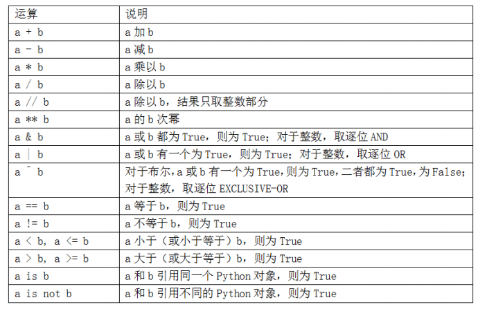
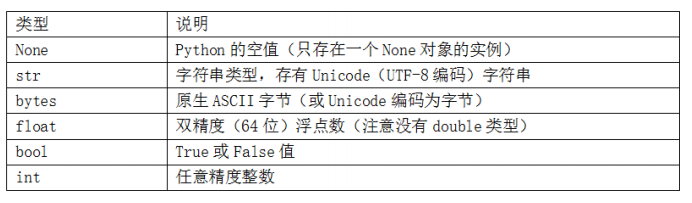

#  Python语法基础

  - Python的语言设计强调的是可读性、简洁和清晰。有些人称Python为“可执行的伪代码”。
  - 缩进：
    - Python使用空白字符（tab和空格）来组织代码，而不是使用括号。
    - 冒号标志着缩进代码块的开始，冒号之后的所有代码的缩进量必须相同，直到代码块结束。
    - 建议使用四个空格作为默认的缩进，可以使用tab代替四个空格。
  - Python语言的一个重要特性就是它的对象模型的一致性。每个数字、字符串、数据结构、函数、类、模块等等，都被认为是Python对象。每个对象都有类型（例如，字符串或函数）和内部数据。
  - 注释：
    - 任何前面带有井号#的文本都会被Python解释器忽略。这通常被用来添加注释。
    - 也可以在执行过的代码后面添加注释。
  - 函数和对象方法调用：
    - 可以用圆括号调用函数，传递零个或几个参数，或者将返回值给一个变量。
    - 几乎Python中的每个对象都有附加的函数，称作方法，可以用来访问对象的内容。
    - 函数可以使用位置和关键词参数。
  - 变量和参数传递：
    - 当你将对象作为参数传递给函数时，新的局域变量创建了对原始对象的引用，而不是复制。
  - 动态引用，强类型：
    - Python中的对象引用不包含附属的类型。
    - 变量是在特殊命名空间中的对象的名字，类型信息保存在对象自身中。
    - 可以用isinstance()检查对象是某个类型的实例。isinstance()可以用类型元组，检查对象的类型是否在元组中。
  - 属性和方法：
    - Python的对象通常都有属性（其它存储在对象内部的Python对象）和方法（对象的附属函数可以访问对象的内部数据）。
    - 可以用obj.attribute_name访问属性和方法，也可以用getattr函数，通过名字访问属性和方法。
  - 鸭子类型：
    - 不关心对象的类型，只关心对象是否有某些方法或用途。这通常被称为“鸭子类型”，来自“走起来像鸭子、叫起来像鸭子，那么它就是鸭子”的说法。
  - 引入：
    - 在Python中，模块就是一个有.py扩展名、包含Python代码的文件。
    - 使用as关键词，你可以给引入起不同的变量名。
  - 二元运算符和比较运算符：
    - 要判断两个引用是否指向同一个对象，可以使用is方法。is not可以判断两个对象是不同的。
    - Python运算符：
    
      
      
  - 可变与不可变对象：
    - Python中的大多数对象，比如列表、字典、NumPy数组，和用户定义的类型（类），都是可变的。
    - 其它的，例如字符串和元组，是不可变的。
  - 标量类型：
    - Python的标准库中有一些内建的类型，用于处理数值数据、字符串、布尔值，和日期时间。这些单值类型被称为标量类型，本书中称其为标量。
    - 主要的标量类型：
    
      
  
    - 数值类型:
      - Python的主要数值类型是int和float。
      - int可以存储任意大的数，浮点数使用float类型。每个数都是双精度（64位）的值。也可以用科学计数法表示。
    - 字符串：
      - 用单引号或双引号来写字符串。对于有换行符的字符串，可以使用三引号，'''或"""都行。
      - Python的字符串是不可变的，不能修改字符串。
      - Python对象使用str函数可以被转化为字符串。
      - 字符串前面加一个r，表明字符就是它自身。
      - 字符串对象有format方法，可以替换格式化的参数为字符串，产生一个新的字符串。
    - 字节和Unicode：
      - 在Python 3及以上版本中，Unicode是一级的字符串类型，这样可以更一致的处理ASCII和Non-ASCII文本。
    - 布尔值：
      - Python中的布尔值有两个，True和False。
    - 类型转换：
      - str、bool、int和float也是函数，可以用来转换类型。
    - None：
      - None是Python的空值类型。如果一个函数没有明确的返回值，就会默认返回None。
      - None也常常作为函数的默认参数。
      - None不仅是一个保留字，还是唯一的NoneType的实例。
    - 日期和时间：
      - Python内建的datetime模块提供了datetime、date和time类型。datetime类型结合了date和time，是最常使用的。
      - 根据datetime实例，你可以用date和time提取出各自的对象。
      - strftime方法可以将datetime格式化为字符串。
      - strptime可以将字符串转换成datetime对象。
      - 两个datetime对象的差会产生一个datetime.timedelta类型。
  - 控制流：
    - Python有若干内建的关键字进行条件逻辑、循环和其它控制流操作。
    - if、elif和else：
      - if后面可以跟一个或多个elif，所有条件都是False时，还可以添加一个else。
    - for循环：
      - for循环是在一个集合（列表或元组）中进行迭代，或者就是一个迭代器。
      - 标准语法：
        ```
        for value in collection:
          # do something
        ```
      - 可以用continue使for循环提前，跳过剩下的部分。
      - 可以用break跳出for循环。break只中断for循环的最内层，其余的for循环仍会运行。
    - While循环：
      - while循环指定了条件和代码，当条件为False或用break退出循环，代码才会退出。
    - pass：
      - pass是Python中的非操作语句。代码块不需要任何动作时可以使用（作为未执行代码的占位符）。
    - range：
      - range函数返回一个迭代器，它产生一个均匀分布的整数序列。
      - range的三个参数是（起点，终点，步进）。
    - 三元表达式：
      - 三元表达式可以将if-else语句放到一行里。
      - 语法：
        ```
        value = true-expression if condition else false-expression
        ```
