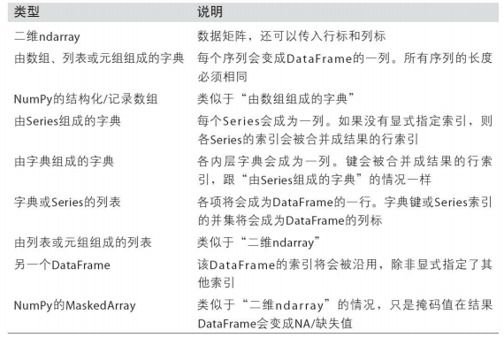
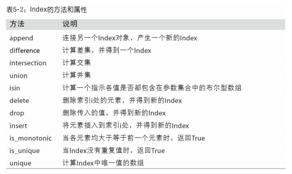
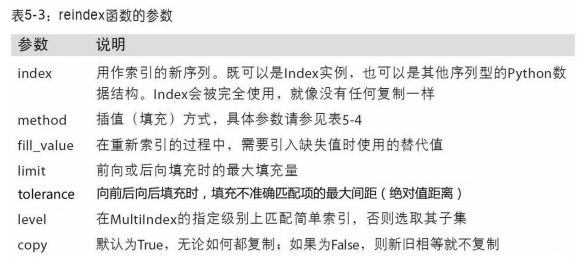
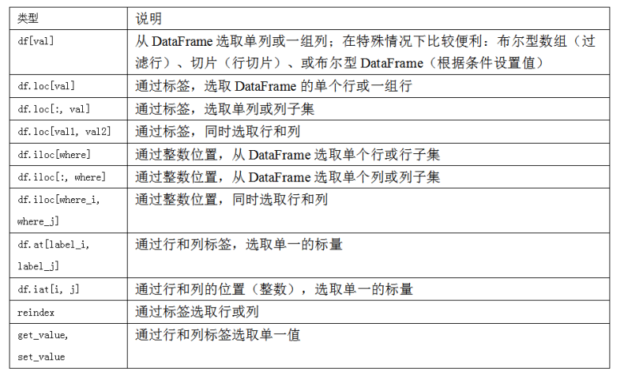
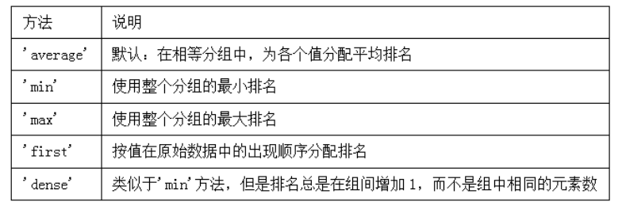
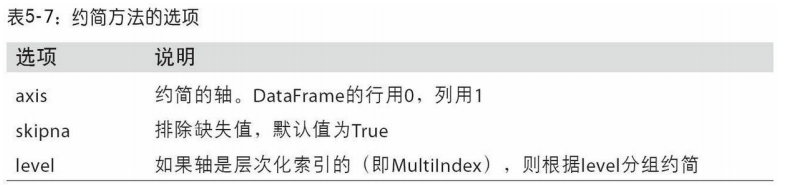
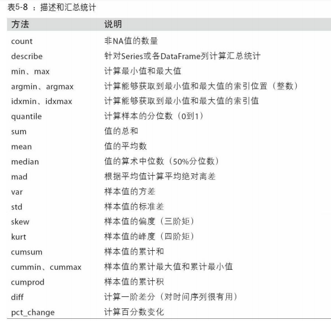

# pandas入门

  - pandas有使数据清洗和分析工作变得更快更简单的数据结构和操作工具。
  - pandas经常和其它工具一同使用，如数值计算工具NumPy和SciPy，分析库statsmodels和scikit-learn，和数据可视化库matplotlib。
  - pandas是基于NumPy数组构建的，特别是基于数组的函数和不使用for循环的数据处理。
  - pandas是专门为处理表格和混杂数据设计的。而NumPy更适合处理统一的数值数组数据。
  
## pandas的数据结构介绍

  - Series：
    - Series是一种类似于一维数组的对象，它由一组数据（各种NumPy数据类型）以及一组与之相关的数据标签（即索引）组成。
    - 语法：
      ```
      ser = pd.Series([4, 7, -1, -3])
      ```
      ```
      ser2 = pd.Series([4, 7, -1, -3], index=['d', 'b', 'a', 'c'])
      ```
    - 可以通过Series的values和index属性获取其数组表示形式和索引对象。
    - 还可以将Series看成是一个定长的有序字典，因为它是索引值到数据值的一个映射。
    - pandas的isnull和notnull函数可用于检测缺失数据。
  - DataFrame：
    - DataFrame是一个表格型的数据结构，它含有一组有序的列，每列可以是不同的值类型（数值、字符串、布尔值等）。
    - DataFrame既有行索引也有列索引。
    - DataFrame中的数据是以一个或多个二维块存放的（而不是列表、字典或别的一维数据结构）。
    - 建DataFrame最常用的一种是直接传入一个由等长列表或NumPy数组组成的字典。
      ```
      data = {'state': ['Ohio', 'Ohio', 'Ohio', 'Nevada', 'Nevada', 'Nevada'],
              'year': [2000, 2001, 2002, 2001, 2002, 2003],
              'pop': [1.5, 1.7, 3.6, 2.4, 2.9, 3.2]
             }
      frame = pd.DataFrame(data)
      ```
    - 通过类似字典标记的方式或属性的方式，可以将DataFrame的列获取为一个Series。返回的Series拥有原DataFrame相同的索引，且其name属性也已经被相应
地设置好了。
    - 行也可以通过位置或名称的方式进行获取，比如用loc属性。
    - 将列表或数组赋值给某个列时，其长度必须跟DataFrame的长度相匹配。如果赋值的是一个Series，就会精确匹配DataFrame的索引，所有的空位都将被填上缺失值。
    - 为不存在的列赋值会创建出一个新列。关键字del用于删除列。
    - 通过索引方式返回的列只是相应数据的视图而已，并不是副本。因此，对返回的Series所做的任何就地修改全都会反映到源DataFrame上。通过Series的copy方法即可指定复制列。
    - 如果嵌套字典传给DataFrame，pandas就会被解释为：外层字典的键作为列，内层键则作为行索引。
    - DataFrame构造函数所能接受的各种数据：
    
      
      
  - 索引对象：
    - pandas的索引对象负责管理轴标签和其他元数据（比如轴名称等）。构建Series或DataFrame时，所用到的任何数组或其他序列的标签都会被转换成一个Index。
    - Index的方法和属性：
    
      
    
## 基本功能

  - 重新索引：
    - pandas对象的一个重要方法是reindex，其作用是创建一个新对象，它的数据符合新的索引。
    - 借助DataFrame，reindex可以修改（行）索引和列。只传递一个序列时，会重新索引结果的行。列可以用columns关键字重新索引。
    - reindex的参数：

      
    
  - 丢弃指定轴上的项：
    - drop方法返回的是一个在指定轴上删除了指定值的新对象。
    - 用标签序列调用drop会从行标签（axis 0）删除值。通过传递axis=1或axis='columns'可以删除列的值。
    - drop用inplace参数可以就地修改对象，不会返回新的对象。小心使用inplace，它会销毁所有被删除的数据。
  - 索引、选取和过滤：
    - Series利用标签的切片运算与普通的Python切片运算不同，其末端是包含的。
    - 用一个值或序列对DataFrame进行索引其实就是获取一个或多个列。
    - 用loc和iloc进行选取：
      - 使用轴标签（loc）或整数索引（iloc），从DataFrame选择行和列的子集。
      - DataFrame索引选项：
      
        
    
    - 整数索引：
      - 如果轴索引含有整数，数据选取总会使用标签。为了更准确，请使用loc（标签）或iloc（整数）。
  - 算术运算和数据对齐：
    - 可以对不同索引的对象进行算术运算。在将对象相加时，如果存在不同的索引对，则结果的索引就是该索引对的并集。就像在索引标签上进行自动外连接。
    - 自动的数据对齐操作在不重叠的索引处引入了NA值。缺失值会在算术运算过程中传播。
    - 在算术方法中填充值：使用df1的add方法，传入df2以及一个fill_value参数。
  - 函数应用和映射：
    - NumPy的ufuncs（元素级数组方法）也可用于操作pandas对象。
    - DataFrame的apply方法可以将函数应用到由各列或行所形成的一维数组上。
  - 排序和排名：
    - 根据条件对数据集排序（sorting）也是一种重要的内置运算。要对行或列索引进行排序（按字典顺序），可使用sort_index方法，它将返回一个已排序的新对象。
    - 数据默认是按升序排序的，但也可以通过设置ascending=False参数降序排序。
    - 在排序时，任何缺失值默认都会被放到Series的末尾。
    - 当排序一个DataFrame时，可以根据一个或多个列中的值进行排序。将一个或多个列的名字传递给sort_values的by选项即可达到该目的。
    - 默认情况下，rank是通过“为各组分配一个平均排名”的方式破坏平级关系的。
    - method参数选项：
    
      
      
  - 带有重复标签的轴索引：
    - 索引的is_unique属性可以告诉你它的值是否是唯一的。
  
## 汇总和计算描述统计

  - 约简方法的常用选项：
  
    
    
  - 描述和汇总统计方法：
  
    
    
  - 相关系数与协方差：
    - Series的corr方法用于计算两个Series中重叠的、非NA的、按索引对齐的值的相关系数。与此类似，cov用于计算协方差。
    - DataFrame的corr和cov方法将以DataFrame的形式分别返回完整的相关系数或协方差矩阵。
  - 唯一值、值计数以及成员资格：
    
    - unique：可以得到Series中的唯一值数组，返回的唯一值是未排序的，如果需要的话，可以对结果再次进行排序。
    - value_counts用于计算一个Series中各值出现的频率。结果Series是按值频率降序排列的。value_counts还是一个顶级pandas方法，可用于任何数组或序列。
    - isin用于判断矢量化集合的成员资格，可用于过滤Series中或DataFrame列中数据的子集。
    
 
