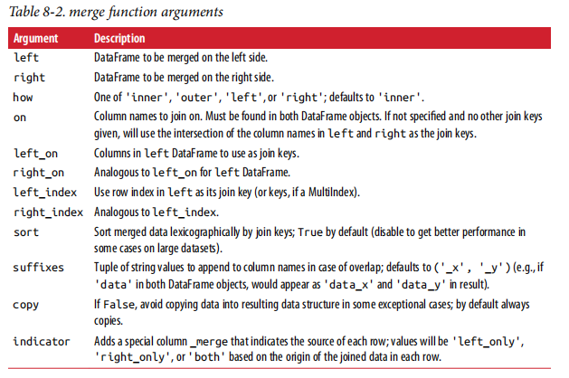

# 数据规整

## 层次化索引

  - 层次化索引（hierarchical indexing）是pandas的一项重要功能，它使你能在一个轴上拥有多个（两个以上）索引级别。抽象点说，它使你能以低维度形式处理高
维度数据。
  - 对于一个层次化索引的对象，可以使用所谓的部分索引，使用它选取数据子集的操作更简单。
  - 层次化索引在数据重塑和基于分组的操作（如透视表生成）中扮演着重要的角色。可以通过unstack方法将这段数据重新安排到一个DataFrame中，unstack的逆运算是stack。
  - 重排与分级排序：
    - swaplevel接受两个级别编号或名称，并返回一个互换了级别的新对象（但数据不会发生变化）。
    - sort_index则根据单个级别中的值对数据进行排序。
  - 根据级别汇总统计：
    - 许多对DataFrame和Series的描述和汇总统计都有一个level选项，它用于指定在某条轴上求和的级别。
  - 使用DataFrame的列进行索引：
    - DataFrame的set_index函数会将其一个或多个列转换为行索引，并创建一个新的DataFrame。默认情况下，那些列会从DataFrame中移除，但也可以将其保留下来。
    - reset_index的功能跟set_index刚好相反，层次化索引的级别会被转移到列里面。
    
## 合并数据集

  - pandas对象中的数据合并方式：
    - pandas.merge可根据一个或多个键将不同DataFrame中的行连接起来。实现的就是数据库的join操作。
    - pandas.concat可以沿着一条轴将多个对象堆叠到一起。
    - 实例方法combine_first可以将重复数据拼接在一起，用一个对象中的值填充另一个对象中的缺失值。
  - 数据集的合并（merge）或连接（join）运算是通过一个或多个键将行连接起来的。
    - 如果没有指明要用哪个列进行连接，merge就会将重叠列的列名当做键。可以通过on指定连接的key。如果两个对象的列名不同，也可以分别进行指定left_on和right_on。
    - 默认情况下，merge做的是“内连接”；结果中的键是交集。其他方式还有"left"、"right"以及"outer"。外连接求取的是键的并集，组合了左连接和右连接的效果。
    - 对于合并运算需要考虑的最后一个问题是对重复列名的处理，merge有一个更实用的suffixes选项，用于指定附加到左右两个DataFrame对象的重叠列名上的字符串。
    - merge函数参数：
    
      
      
  - 索引上的合并:
    - 如果DataFrame中的连接键位于其索引中，可以传入left_index=True或right_index=True（或两个都传）以说明索引应该被用作连接键。
    - DataFrame还有join实例方法，它能更为方便地实现按索引合并。它还可用于合并多个带有相同或相似索引的DataFrame对象，但要求没有重叠的列。DataFrame的join方法默认使用的是左连接，保留
左边表的行索引。
  - 轴向连接：
    - 另一种数据合并运算也被称作连接（concatenation）、绑定（binding）或堆叠（stacking）。NumPy的concatenation函数可以用NumPy数组来做。
    - pandas的concat函数可以将值和索引粘合在一起。默认情况下，concat是在axis=0上工作的，最终产生一个新的Series。如果传入axis=1，则结果就会变成一个DataFrame（axis=1是列）。
    - concat函数想要在连接轴上创建一个层次化索引。使用keys参数即可达到这个目的。如果沿着axis=1对Series进行合并，则keys就会成为DataFrame的列头。
  - 合并重叠数据：
    - combine_first函数就是用传递对象中的数据为调用对象的缺失数据“打补丁”。
  
## 重塑和轴向旋转
    
  - 有许多用于重新排列表格型数据的基础运算。这些函数也称作重塑（reshape）或轴向旋转（pivot）运算。
  - 重塑层次化索引：
    - stack：将数据的列“旋转”为行。unstack：将数据的行“旋转”为列。
    - 默认情况下，unstack操作的是最内层（stack也是如此）。传入分层级别的编号或名称即可对其它级别进行unstack操作。
  - 将“长格式”旋转为“宽格式”：
    - 多个时间序列数据通常是以所谓的“长格式”（long）或“堆叠格式”（stacked）存储在数据库和CSV中的。
    - DataFrame的pivot方法前两个传递的值分别用作行和列索引，最后一个可选值则是用于填充DataFrame的数据列。pivot其实就是用set_index创建层次化索引，再用unstack重塑。
  - 将“宽格式”旋转为“长格式”：
    - 旋转DataFrame的逆运算是pandas.melt。它不是将一列转换到多个新的DataFrame，而是合并多个列成为一个，产生一个比输入长的DataFrame。当使用pandas.melt，我们必须指明
哪些列是分组指标。
    
    
