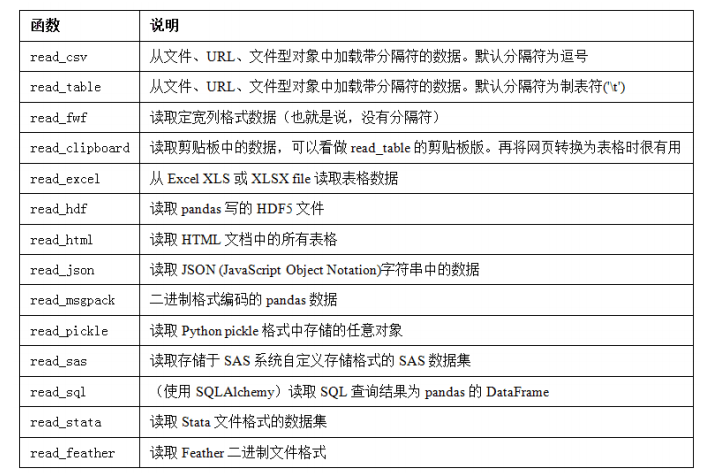
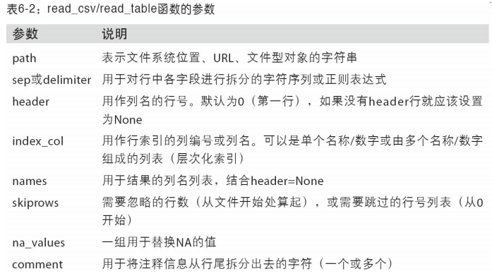
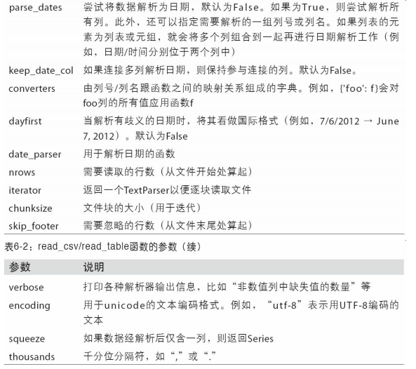
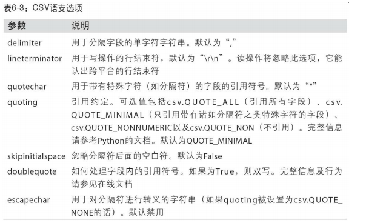

# 数据加载、存储与文件格式

  - 输入输出通常可以划分为几个大类：读取文本文件和其他更高效的磁盘存储格式，加载数据库中的数据，利用Web API操作网络资源。
  
## 读写文本格式的数据

  - pandas读取数据的函数：
  
    

    - 这些函数的常用选项：
      - 索引：将一个或多个列当做返回的DataFrame处理，以及是否从文件、用户获取列名。
      - 类型推断和数据转换：包括用户定义值的转换、和自定义的缺失值标记列表等。
      - 日期解析：包括组合功能，比如将分散在多个列中的日期时间信息组合成结果中的单个列。
      - 迭代：支持对大文件进行逐块迭代。
      - 不规整数据问题：跳过一些行、页脚、注释或其他一些不重要的东西。
    - 缺失值处理是文件解析任务中的一个重要组成部分。缺失数据经常是要么没有（空字符串），要么用某个标记值表示。默认情况下，pandas会用一组经常出现的标记值进行识别，比如NA及NULL。
    - read_csv和read_table函数的参数：

      

      

    - 逐块读取文本文件：
      - 如果只想读取几行（避免读取整个文件），通过nrows进行指定即可。
      - 要逐块读取文件，可以指定chunksize（行数）。
  - 将数据写出到文本格式：
    - 利用DataFrame的to_csv方法，可以将数据写到一个以逗号分隔的文件中。
    - 缺失值在输出结果中会被表示为空字符串。可以通过na_rep参数将其表示为别的标记值。
  - 处理分隔符格式：
    - 对于任何单字符分隔符文件，可以直接使用Python内置的csv模块。将任意已打开的文件或文件型的对象传给csv.reader。对这个reader进行迭代将会为每行产生一个元组（并移除了所有的引号）。
    - CSV文件的形式有很多。只需定义csv.Dialect的一个子类即可定义出新格式（如专门的分隔符、字符串引用约定、行结束符等）。
    - CSV语支的参数：
    
      
      
  - JSON数据：
    - JSON（JavaScript Object Notation的简称）已经成为通过HTTP请求在Web浏览器和其他应用程序之间发送数据的标准格式之一。
    - 基本类型有对象（字典）、数组（列表）、字符串、数值、布尔值以及null。对象中所有的键都必须是字符串。
    - 通过json.loads即可将JSON字符串转换成Python形式。json.dumps则将Python对象转换成JSON格式。
    - pandas.read_json可以自动将特别格式的JSON数据集转换为Series或DataFrame。默认选项假设JSON数组中的每个对象是表格中的一行。如果你需要将数据从pandas输出到JSON，可以使用to_json方法。
  - XML和HTML：Web信息收集：
    - Python有许多常见的HTML和XML格式数据的库，包括lxml、Beautiful Soup和 html5lib。lxml的速度比较快，但其它的库处理有误的HTML或XML文件更好。
    - pandas有一个内置的功能，read_html，它可以使用lxml和Beautiful Soup自动将HTML文件中的表格解析为DataFrame对象。
    
## 二进制数据格式

  - 实现数据的高效二进制格式存储办法之一是使用Python内置的pickle序列化。pandas对象都有一个用于将数据以pickle格式保存到磁盘上的to_pickle方法。
  - 可以通过pickle直接读取被pickle化的数据，或是使用更为方便的pandas.read_pickle。
  - pandas内置支持两个二进制数据格式：HDF5和MessagePack。
  - HDF5格式：
    - HDF5是一种存储大规模科学数组数据的非常好的文件格式。HDF5中的HDF指的是层次型数据格式（hierarchical data format）。每个HDF5文件都含有一个文件系统式的节点结构，它使你能够存储多个数据集并支持元数据。
    - HDF5支持多种压缩器的即时压缩，还能更高效地存储重复模式数据。
    - pandas提供了更为高级的接口HDFStore类可以像字典一样，处理低级的细节。HDFStore支持两种存储模式，'fixed'和'table'。
  - Microsoft Excel文件：
    - pandas的ExcelFile类或pandas.read_excel函数支持读取存储在Excel 2003（或更高版本）中的表格型数据。
    - 如果要将pandas数据写入为Excel格式，你必须首先创建一个ExcelWriter，然后使用pandas对象的to_excel方法将数据写入到其中。
    
## Web APIs交互

  - 许多网站都有一些通过JSON或其他格式提供数据的公共API。通过Python访问这些API的简单方法是requests package。
  
## 数据库交互

  - 从表中选取数据时，大部分Python SQL驱动器（PyODBC、psycopg2、MySQLdb、 pymssql等）都会返回一个元组列表。
  - pandas有一个read_sql函数，可以让你轻松的从SQLAlchemy连接读取数据。
 
