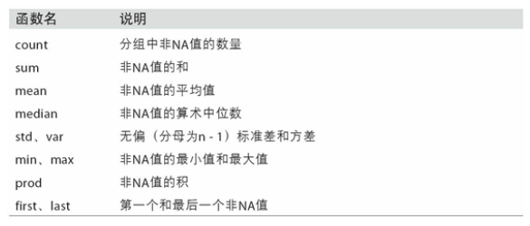
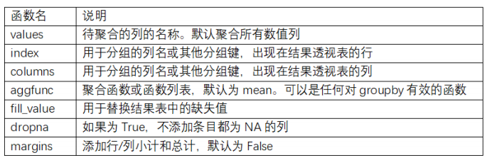

# 数据聚合与分组运算

## GroupBy机制

  - 表示分组运算的术语"split-apply-combine"（拆分－应用－合并）。第一个阶段，pandas对象中的数据会根据你所提供的一个或多个键被拆分（split）为多组。拆分操作是在对象的特定轴上执行的。例如，DataFrame可以在其行（axis=0）或列（axis=1）上进行分组。然后，将一个函数应用（apply）到各个分组并产生一个新值。最后，所有这些函数的执行结果会被合并（combine）到最终的
结果对象中。
  - 通常，分组信息就位于相同的要处理DataFrame中。这里，你还可以将列名（可以是字符串、数字或其他Python对象）用作分组键。
  - GroupBy对象支持迭代，可以产生一组二元元组（由分组名和数据块组成）。对于多重键的情况，元组的第一个元素将会是由键值组成的元组。
  - groupby默认是在axis=0上进行分组的，通过设置也可以在其他任何轴上进行分组。
  
## 数据聚合

  - 常见的聚合函数：
  
    
    
  - 可以调用分组对象上已经定义好的任何方法。例如，quantile可以计算Series或DataFrame列的样本分位数。
  - 如果要使用你自己的聚合函数，只需将其传入aggregate或agg方法即可。
  
## apply：一般性的“拆分－应用－合并”

  - apply会将待处理的对象拆分成多个片段，然后对各片段调用传入的函数，最后尝试将各片段组合到一起。
  - 分组键会跟原始对象的索引共同构成结果对象中的层次化索引。将group_keys=False传入groupby即可禁止该效果。
  - 分位数和桶分析：
    - pandas有一些能根据指定面元或样本分位数将数据拆分成多块的工具（比如cut和qcut）。将这些函数跟groupby结合起来，就能非常轻松地实现对数据集的桶（bucket）或分位数（quantile）分析了。
    
## 透视表和交叉表

  - 透视表（pivot table）是各种电子表格程序和其他数据分析软件中一种常见的数据汇总工具。它根据一个或多个键对数据进行聚合，并根据行和列上的分组键将数据分配到各个矩形区域中。
    - DataFrame有一个pivot_table方法，还有一个顶级的pivot_table函数。除为groupby提供便利之外，pivot_table还可以添加分项小计，也叫做margins。
    - pivot_table的参数：

      
    
  - 交叉表：（cross-tabulation，简称crosstab）是一种用于计算分组频率的特殊透视表。
  
