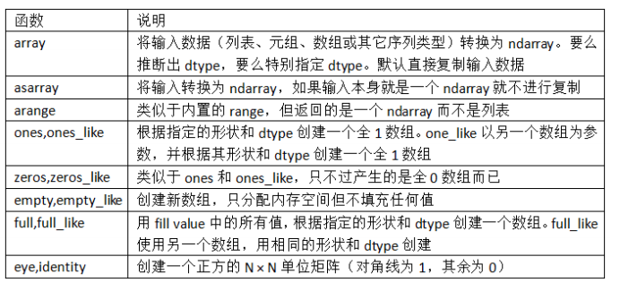
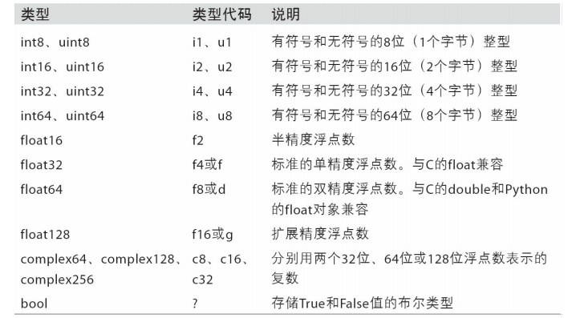
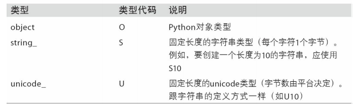
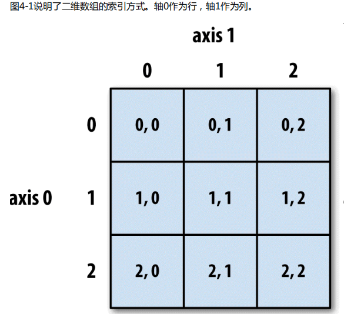
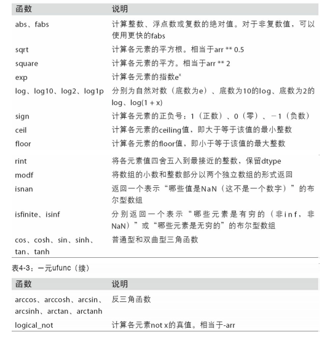
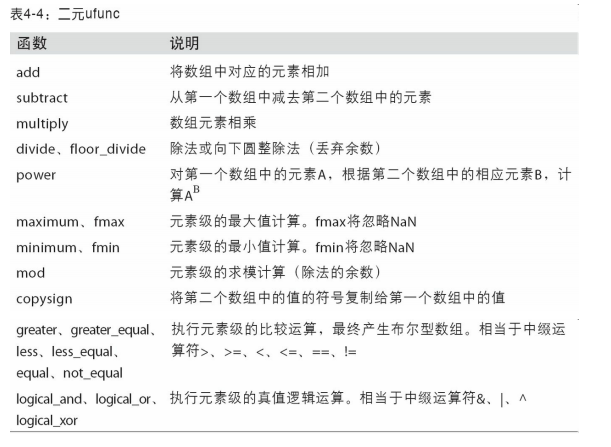
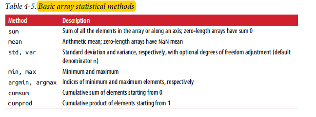
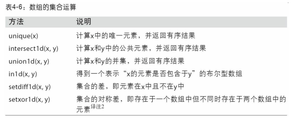
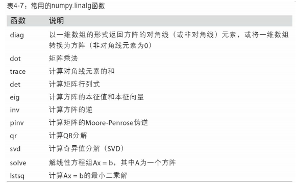
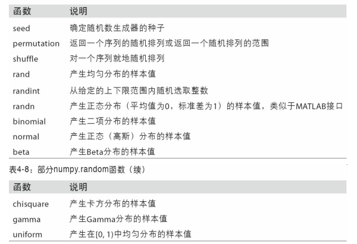

# 第四章 NumPy基础

  - NumPy（Numerical Python）是Python数值计算最重要的基础包。大多数提供科学计算的包都是用NumPy的数组作为构建基础。
  - NumPy的部分功能：
    - ndarray，一个具有矢量算术运算和复杂广播能力的快速且节省空间的多维数组。
    - 用于对整组数据进行快速运算的标准数学函数（无需编写循环）。
    - 用于读写磁盘数据的工具以及用于操作内存映射文件的工具。
    - 线性代数、随机数生成以及傅里叶变换功能。
  - 对于大部分数据分析应用而言，最关注的功能主要集中在：
    - 用于数据整理和清理、子集构造和过滤、转换等快速的矢量化数组运算。
    - 常用的数组算法，如排序、唯一化、集合运算等。
    - 高效的描述统计和数据聚合/摘要运算。
    - 用于异构数据集的合并/连接运算的数据对齐和关系型数据运算。
    - 将条件逻辑表述为数组表达式（而不是带有if-elif-else分支的循环）。
    - 数据的分组运算（聚合、转换、函数应用等）。
  - NumPy可以高效处理大数组的数据：
    - NumPy是在一个连续的内存块中存储数据，独立于其他Python内置对象。NumPy的C语言编写的算法库可以操作内存，而不必进行类型检查或其它前期工作。比起Python的内置序列，NumPy数组使用的内存更少。
    - NumPy可以在整个数组上执行复杂的计算，而不需要Python的for循环。
    
## NumPy的ndarray：一种多维数组对象

  - N维数组对象（即ndarray），该对象是一个快速而灵活的大数据集容器。
  - ndarray是一个通用的同构数据多维容器，其中的所有元素必须是相同类型的。每个数组都有一个shape（一个表示各维度大小的元组）和一个dtype（一个用于说明数组数据类型的对象）
  - 创建ndarray：
    - 创建数组最简单的办法就是使用np.array函数。它接受一切序列型的对象（包括其他数组），然后产生一个新的含有传入数据的NumPy数组。
    - zeros和ones分别可以创建指定长度或形状的全0或全1数组。empty可以创建一个没有任何具体值的数组。要用这些方法创建多维数组，只需传入一个表示形状的元组即可。
    - arange是Python内置函数range的数组版。
    - 创建数组的函数：
      
      
      
  - ndarray的数据类型：
    - dtype（数据类型）是一个特殊的对象，它含有ndarray将一块内存解释为特定数据类型所需的信息。
    - NumPy的数据类型：
    
      
      
      
      
    - 可以通过ndarray的astype方法明确地将一个数组从一个dtype转换成另一个dtype。
  - NumPy数组的运算：
    - 大小相等的数组之间的任何算术运算都会将运算应用到元素级。
    - 数组与标量的算术运算会将标量值传播到各个元素。
    - 大小相同的数组之间的比较会生成布尔值数组。
  - 基本的索引和切片：
    - 跟列表最重要的区别在于，数组切片是原始数组的视图。这意味着数据不会被复制，视图上的任何修改都会直接反映到源数组上。
    - 切片[ : ]会给数组中的所有值赋值。
    - 如果你想要得到的是ndarray切片的一份副本而非视图，就需要明确地进行复制操作，例如arr[5:8].copy()。
    - 二维数组的索引方式：
    
      
      
    - 切片索引：
      - ndarray的切片语法跟Python列表这样的一维对象差不多。
      - 对于二维数组，它是沿着第0轴（即第一个轴）切片的。也就是说，切片是沿着一个轴向选取元素的。
    - 布尔型索引：
      - 布尔型数组的长度必须跟被索引的轴长度一致。此外，还可以将布尔型数组跟切片、整数混合使用。
      - Python关键字and和or在布尔型数组中无效。要使用&与|。
    - 花式索引：
      - 花式索引（Fancy indexing）是一个NumPy术语，它指的是利用整数数组进行索引。
      - 为了以特定顺序选取行子集，只需传入一个用于指定顺序的整数列表或ndarray即可。
  - 数组转置和轴对换：
    - 转置是重塑的一种特殊形式，它返回的是源数据的视图（不会进行任何复制操作）。数组不仅有transpose方法，还有一个特殊的T属性。
  
## 通用函数：快速的元素级数组函数

  - 通用函数（即ufunc）是一种对ndarray中的数据执行元素级运算的函数。
  - 一元ufunc：
  
    
    
  - 二元ufunc：
  
    
    
## 利用数组进行数据处理

  - 用数组表达式代替循环的做法，通常被称为矢量化。一般来说，矢量化数组运算要比等价的纯Python方式快上一两个数量级。    
  - 将条件逻辑表述为数组运算：
    - numpy.where函数是三元表达式x if condition else y的矢量化版本。
      ```
      result = np.where(condition, xarr, yarr)
      ```
    - np.where的第二个和第三个参数不必是数组，它们都可以是标量值。
    - 在数据分析工作中，where通常用于根据另一个数组而产生一个新的数组。
  - 数学和统计方法：
    - 基本数组统计方法：
    
      
      
  - 用于布尔型数组的方法：
    - 在上面这些方法中，布尔值会被强制转换为1（True）和0（False）。因此，sum经常被用来对布尔型数组中的True值计数。
    - any用于测试数组中是否存在一个或多个True，而all则检查数组中所有值是否都是True。
  - 排序：
    - NumPy数组也可以通过sort方法就地排序。
    - 多维数组可以在任何一个轴向上进行排序，只需将轴编号传给sort即可。
    - 顶级方法np.sort返回的是数组的已排序副本，而就地排序则会修改数组本身。计算数组分位数最简单的办法是对其进行排序，然后选取特定位置的值。
  - 唯一化以及其它的集合逻辑：
    - 数组的集合运算：
    
      
      
## 用于数组的文件输入输出

  - np.save和np.load是读写磁盘数组数据的两个主要函数。默认情况下，数组是以未压缩的原始二进制格式保存在扩展名为.npy的文件中的。
  - 通过np.savez可以将多个数组保存到一个未压缩文件中（npz文件），将数组以关键字参数的形式传入即可。加载.npz文件时，你会得到一个类似字典的对象，该对象会对各个数组进行延迟加载。
  - 如果要将数据压缩，可以使用numpy.savez_compressed。
  
## 线性代数

  - 常用的线性代数函数：
  
    
    
## 伪随机数生成

  - numpy.random模块对Python内置的random进行了补充，增加了一些用于高效生成多种概率分布的样本值的函数。
  - 这些都是伪随机数，是因为它们都是通过算法基于随机数生成器种子，在确定性的条件下生成的。可以用NumPy的np.random.seed更改随机数生成种子。
  - numpy.random函数：
  
    
