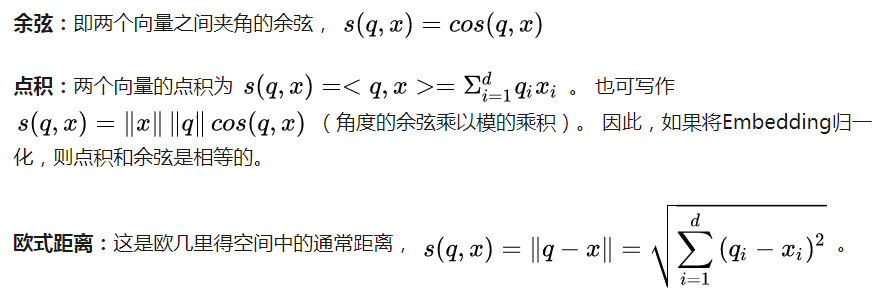
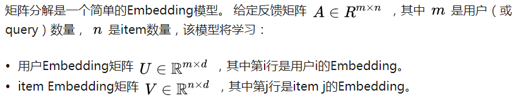
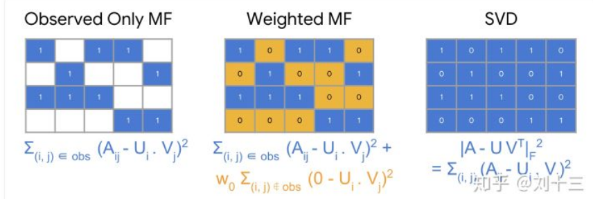

# 概述

## 一些术语：

  - 条目(Item)：推荐系统的实体。 对于淘宝来说，这些条目是用户要购买的商品。 对于抖音，这些条目是视频。
  - 查询(Query)：推荐系统用以给出推荐的相关信息，查询可以是以下各项的组合。
    - 用户信息：用户的ID，身份信息等
    - 上下文信息：一天中的时间，用户的设备等
    - 条目信息：商品名称，商品类别。
  - 嵌入(Embedding)：从离散集合（查询集或要推荐的条目）到嵌入（Embedding）空间的向量空间映射。
  
## 推荐系统架构

  - 推荐系统的一种通用体系架构由三部分组成：召回、打分、重排。
    - 召回（粗排）：系统从潜在的庞大语料库生成更小的候选集。考虑到语料库的庞大规模，该模型需要快速评估查询。给定模型可以有多个召回队列，每个召回队列都筛选出不同类型的候选子集。
    - 计分（精排）：另一个模型对候选集进行评分和排序，以选择要显示给用户的集合（大约10个）。
    - 重排（调序）：系统必须考虑最终排名的其他限制。例如，系统删除用户明确不喜欢的项目或提高时效内容的得分。重新排序还可以帮助确保多样性，时效性和公平性。
    
# 召回

## 召回概述

  - 常见的召回方法：
    - 基于内容的过滤：使用item之间的相似性来推荐与用户喜欢的item相似的item。
    - 协同过滤：同时使用query和item之间的相似性来进行推荐。
    - 基于神经网络的方法：利用神经网络生成相应的候选集。
    
## 向量空间

  - 基于内容的过滤和协同过滤都将每个item和每个query（或上下文）映射到公共Embedding空间中的Embedding向量。通常，Embedding空间是低维的（即， d比语料库的大小小得多），用以表示item或query的某些潜在含义。相似item最终在Embedding空间中拥有相近的表示。 “相似性”的概念由相似性度量定义。

## 相似性度量

  - 常用的相似性度量方法：
    - 余弦(cosine)
    - 点积(dot product)
    - 欧式距离(Euclidean distance)
    
    
    
## 基于内容的过滤
  - 根据用户先前的操作或明确的反馈(例如点击，评论等)，基于内容的过滤使用item相关特征来推荐给用户与之前喜欢的item类似的item。
  - 基于内容过滤的优点:
    - 该模型不需要其他用户的任何数据，因为推荐是针对该用户的。 这使得更容易扩展到大量用户。
    - 该模型可以捕获用户的特定兴趣，并可以推荐其他用户很少感兴趣的但该用户喜欢的item。
  - 基于内容过滤的缺点
    - 由于item的特征表示在某种程度上是手工设计的，因此该技术需要大量领域知识。 因此，模型很依赖手工设计特征的好坏。
    - 该模型只能根据用户的现有兴趣提出建议。 换句话说，该模型扩展用户现有兴趣的能力有限。
      
## 协同过滤
  - 协同过滤同时使用用户或item之间的相似性来进行推荐。 这样可以提高模型的推荐拓展性。此外，可以自动学习Embedding，而无需依赖手工设计的特征。
  - 当模型自动学习Embedding时，这种方法的协同性质就显而易见了。 假设电影的Embedding矢量是固定的。 然后，模型可以为用户学习Embedding向量，以最好地解释他们的偏好。 因此，具有相似偏好的用户的Embedding将紧密在一起。 同样，如果用户的Embedding是固定的，则我们可以学习电影Embedding以最好地解释反馈矩阵。 结果，类似用户喜欢的电影的Embedding将在Embedding空间中紧密在一起。
  - 矩阵分解
  

  - 选择目标函数
  

  - 最小化目标函数
    - 随机梯度下降(SGD)
    - 加权交替最小二乘(WALS): WALS的工作方式是随机初始化Embedding，然后在以下条件之间交替进行.
      - 固定U求解V
      - 固定V求解U

  - SGD vs. WALS
    - SGD优点:
      - 非常灵活：适用于其他损失函数。
      - 可以并行化。
    - SGD缺点:
      - 较慢：收敛速度不那么快。
      - 难以处理未观察到的项（entries），需要使用负采样或gravity。
    - WALS优点:
      - 可以并行化。
      - 收敛速度比SGD更快。
      - 更容易处理未观察到的项（entries）。
    - WALS缺点:
      - 仅适用于平方损失。

  - 协同过滤的优点和缺点
    - 优点：
      - 无需领域知识
      - 发掘用户兴趣
      - 初始模型比较容易，仅需要反馈矩阵即可训练矩阵分解模型。
    - 缺点：
      - 冷启动问题
      - 难以融入query/item的附加特征

## 深度神经网络模型

  - 深度神经网络（DNN）模型可以解决矩阵分解的这些限制。 DNN可以轻松地融入query特征和item特征（由于网络输入层的灵活性），这可以帮助捕获用户的特定兴趣并提高推荐的相关性。
  
### Softmax DNN 模型

