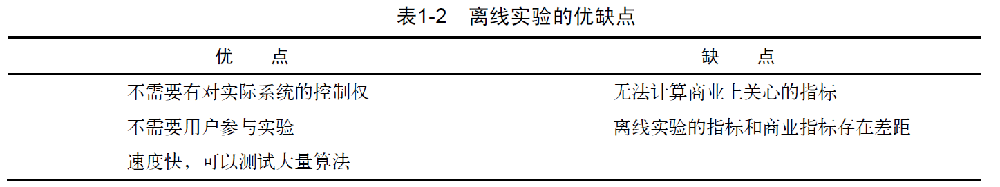
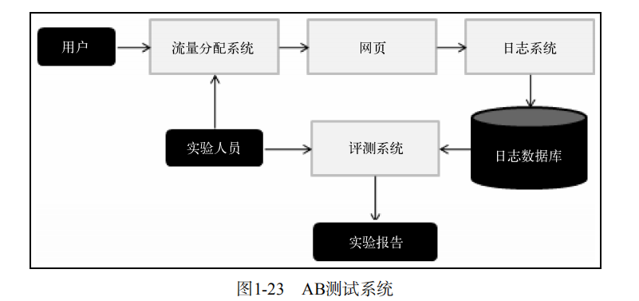
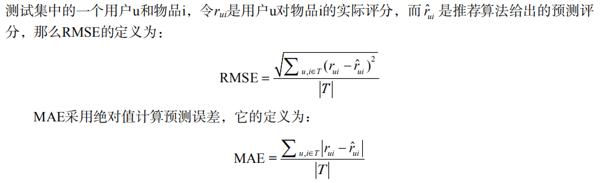

# 好的推荐系统
## 1.1 什么是推荐系统
* 推荐系统的任务就是联系用户和信息，一方面帮助用户发现对自己有价值的信息，另一方面让信息能够展现在对它感兴趣的用户面前，从而实现信息消费者和信息生产者的双赢。
* 推荐系统和搜索引擎对于用户来说是两个互补的工具。搜索引擎满足了用户有明确目的时的主动查找需求，而推荐系统能够在用户没有明确目的的时候帮助他们发现感兴趣的新内容。
* 推荐系统通过发掘用户的行为，找到用户的个性化需求，从而将长尾商品准确地推荐给需要它的用户，帮助用户发现那些他们感兴趣但很难发现的商品。
## 1.2 个性化推荐系统的应用
* 电子商务: 个性化商品推荐列表和相关商品的推荐列表。(Amazon)
* 电影和视频网站: Netflix, YouTube。
* 个性化音乐网络电台: Pandora, 豆瓣网络电台。
* 社交网络: Facebook, Twitter, 新浪微博。
* 个性化阅读：Google Reader, 鲜果网。
* 基于位置的服务：Foursquare。
* 个性化邮件：Gmail Priority Inbox。
* 个性化广告: Yahoo。
## 1.3 推荐系统评测
一个完整的推荐系统一般存在3个参与方：用户、物品提供者和提供推荐系统的网站。因此在评测一个推荐算法时，需要同时考虑三方的利益，一个好的推荐系统是能够令三方共赢的系统。

评测推荐系统指标包括准确度、覆盖度、新颖度、惊喜度、信任度、透明度。

### 1.3.1 推荐系统实验方法
在推荐系统中，主要有3种评测推荐效果的实验方法，即离线实验（offline experiment）、用户调查（user study）和在线实验（online experiment）。

1.离线实验
  - 通过日志系统获得用户行为数据，并按照一定格式生成一个标准的数据集；
  - 将数据集按照一定的规则分成训练集和测试集；
  - 在训练集上训练用户兴趣模型，在测试集上进行预测；
  - 通过事先定义的离线指标评测算法在测试集上的预测结果。

2.用户调查
  - 用户调查需要有一些真实用户，让他们在需要测试的推荐系统上完成一些任务。在他们完成任务时，我们需要观察和记录他们的行为，并让他们回答一些问题。最后，我们需要通过分析他们的行为和答案了解测试系统的性能。
  - 用户调查是推荐系统评测的一个重要工具，很多离线时没有办法评测的与用户主观感受有关的指标都可以通过用户调查获得。
  - 用户调查也有一些缺点: 首先，用户调查成本很高，需要用户花大量时间完成一个个任务，并回答相关的问题。我们在做用户调查时，一方面要控制成本，另一方面又要保证结果的统计意义。
  - 此外，测试用户也不是随便选择的。需要尽量保证测试用户的分布和真实用户的分布相同，比如男女各半，以及年龄、活跃度的分布都和真实用户分布尽量相同。
  - 用户调查要尽量保证是双盲实验，不要让实验人员和用户事先知道测试的目标，以免用户的回答和实验人员的测试受主观成分的影响。

3.在线实验
  - 在完成离线实验和必要的用户调查后，可以将推荐系统上线做AB测试，将它和旧的算法进行比较。
  - AB测试是一种很常用的在线评测算法的实验方法。 它通过一定的规则将用户随机分成几组，并对不同组的用户采用不同的算法，然后通过统计不同组用户的各种不同的评测指标比较不同算法，比如可以统计不同组用户的点击率，通过点击率比较不同算法的性能。
  - AB测试的优点是可以公平获得不同算法实际在线时的性能指标，包括商业上关注的指标。AB测试的缺点主要是周期比较长，必须进行长期的实验才能得到可靠的结果。其次，一个大型网站的AB测试系统的设计也是一项复杂的工程。

### 1.3.2 评测指标
  - 用户满意度: 用户满意度没有办法离线计算，只能通过用户调查或者在线实验获得。
  - 预测准确度: 预测准确度度量一个推荐系统或者推荐算法预测用户行为的能力。这个指标是最重要的推荐系统离线评测指标。在计算该指标时需要有一个离线的数据集，该数据集包含用户的历史行为记录。然后，将该数据集通过时间分成训练集和测试集。最后，通过在训练集上建立用户的行为和兴趣模型预测用户在测试集上的行为，并计算预测行为和测试集上实际行为的重合度作为预测准确度。
  - 评分预测的预测准确度一般通过均方根误差（RMSE）和平均绝对误差（MAE）计算。
 
