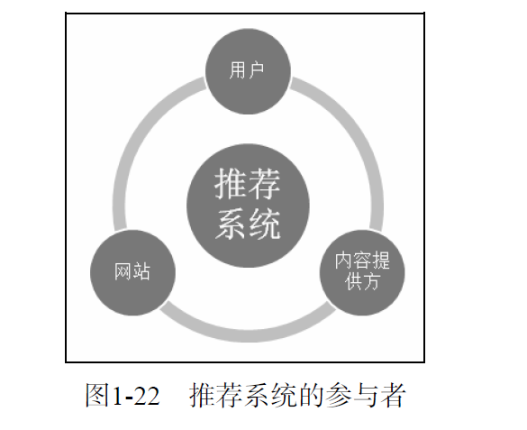

# 好的推荐系统
## 1.1 什么是推荐系统
* 推荐系统的任务就是联系用户和信息，一方面帮助用户发现对自己有价值的信息，另一方面让信息能够展现在对它感兴趣的用户面前，从而实现信息消费者和信息生产者的双赢。
* 推荐系统和搜索引擎对于用户来说是两个互补的工具。搜索引擎满足了用户有明确目的时的主动查找需求，而推荐系统能够在用户没有明确目的的时候帮助他们发现感兴趣的新内容。
* 推荐系统通过发掘用户的行为，找到用户的个性化需求，从而将长尾商品准确地推荐给需要它的用户，帮助用户发现那些他们感兴趣但很难发现的商品。
## 1.2 个性化推荐系统的应用
* 电子商务: 个性化商品推荐列表和相关商品的推荐列表。(Amazon)
* 电影和视频网站: Netflix, YouTube。
* 个性化音乐网络电台: Pandora, 豆瓣网络电台。
* 社交网络: Facebook, Twitter, 新浪微博。
* 个性化阅读：Google Reader, 鲜果网。
* 基于位置的服务：Foursquare。
* 个性化邮件：Gmail Priority Inbox。
* 个性化广告: Yahoo。
## 1.3 推荐系统评测
一个完整的推荐系统一般存在3个参与方：用户、物品提供者和提供推荐系统的网站。因此在评测一个推荐算法时，需要同时考虑三方的利益，一个好的推荐系统是能够令三方共赢的系统。

