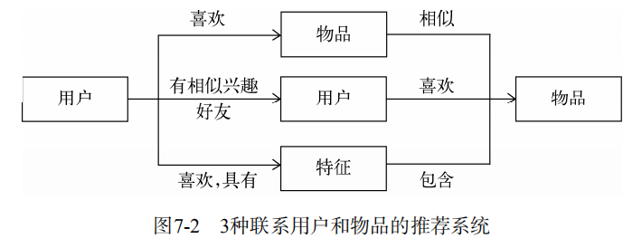
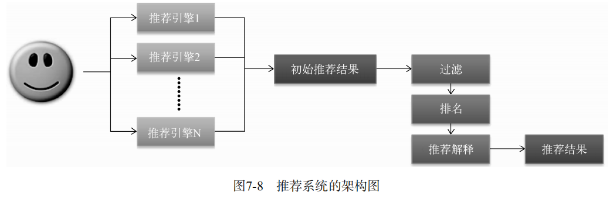

# 推荐系统实例

## 7.1 外围架构

  - 推荐系统外围架构：
  
  
  - 推荐系统界面共性：
    - 通过一定方式展示物品，主要包括物品的标题、缩略图和介绍等。
    - 很多推荐界面都提供了推荐理由，理由可以增加用户对推荐结果的信任度。
    - 推荐界面还需要提供一些按钮让用户对推荐结果进行反馈，这样才能让推荐算法不断改善用户的个性化推荐体验。
    
  - 数据收集和存储
    - 按照数据的规模和是否需要实时存取，不同的行为数据将被存储在不同的媒介中。
    - 一般来说，需要实时存取的数据存储在数据库和缓存中，而大规模的非实时地存取数据存储在分布式文件系统（如HDFS）中。
    
## 7.2 推荐系统架构

  - 用户和物品联系方式：
  
  
  - 基于特征的推荐系统架构拆解成两部分，一个是如何为给定用户生成特征，另一个是如何根据特征找到物品。
  
  - 用户的特征种类：
    - 人口统计学特征：包括用户的年龄、性别、国籍和民族等用户在注册时提供的信息。
    - 用户的行为特征：包括用户浏览过什么物品、收藏过什么物品、给什么物品打过什么样的分数等用户行为相关的特征。同时，用户行为从时间上也可以分为用户近期的行为和长期的行为。
    - 用户的话题特征：可以根据用户的历史行为利用话题模型（topic model）将电视剧和电影聚合成不同的话题，并且计算出每个用户对什么话题感兴趣。
    
  - 推荐系统的推荐任务：
    - 将最新加入的物品推荐给用户。
    - 将商业上需要宣传的物品推荐给用户。
    - 给用户推荐不同种类的物品。
    - 给用户混合推荐，有时需要将图书和音像制品放到一个推荐列表中展示给用户。
    - 推荐不同新颖度的物品。
    - 考虑到用户访问推荐系统的上下文。
    
  - 推荐系统需要由多个推荐引擎组成，每个推荐引擎负责一类特征和一种任务，而推荐系统的任务只是将推荐引擎的结果按照一定权重或者优先级合并、排序然后返回。 
  
  
  
