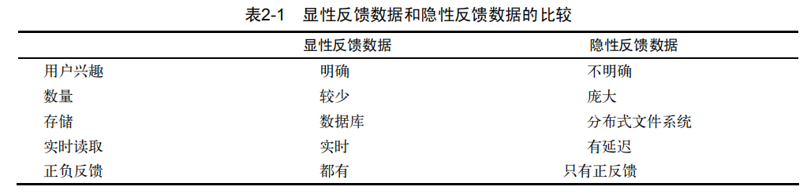
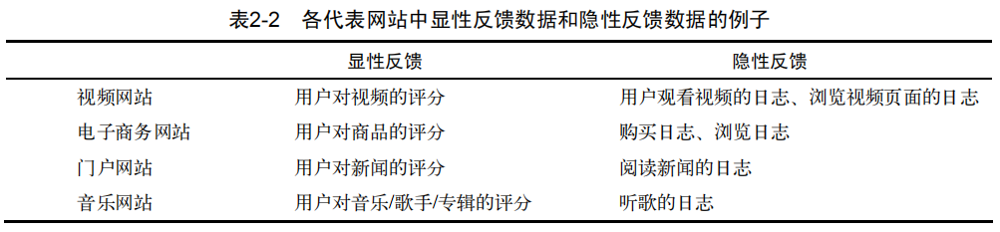
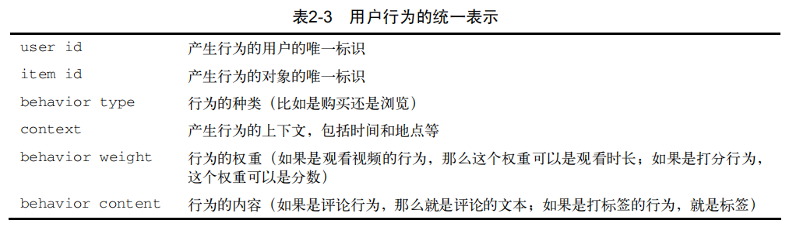
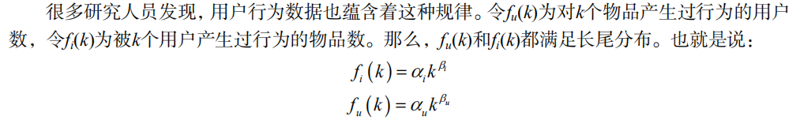

# 利用用户行为数据

基于用户行为分析的推荐算法是个性化推荐系统的重要算法，学术界一般将这种类型的算法称为协同过滤算法。

## 2.1 用户行为数据

  - 用户行为数据在网站上最简单的存在形式就是日志。网站在运行过程中都产生大量原始日志（raw log），并将其存储在文件系统中。很多互联网业务会把多种原始日志按照用户行为汇总成会话日志（session log），其中每个 会话表示一次用户行为和对应的服务。这些日志记录了用户的各种行为，如在电子商务网站中这些行为主要包括网页浏览、购买、点击、评分和评论等。
  - 用户行为在个性化推荐系统中一般分两种——显性反馈行为（explicit feedback）和隐性反馈行为（implicit feedback）。显性反馈行为包括用户明确表示对物品喜好的行为。这里的主要方式就是评分和喜欢/不喜欢。隐性反馈行为指的是那些不能明确反应用户喜好的行为。最具代表性的隐性反馈行为就是页面浏览行为。
  
  

  - 按照反馈的明确性分，用户行为数据可以分为显性反馈和隐性反馈，但按照反馈的方向分，又可以分为正反馈和负反馈。正反馈指用户的行为倾向于指用户喜欢该物品，而负反馈指用户的行为倾向于指用户不喜欢该物品。
  
  
  
  - 用户行为的表示：
  
  
  
  - 代表性的数据集:
    - 无上下文信息的隐性反馈数据集： 每一条行为记录仅仅包含用户ID和物品ID。（Book-Crossing）
    - 无上下文信息的显性反馈数据集： 每一条记录包含用户ID、物品ID和用户对物品的评分。
    - 有上下文信息的隐性反馈数据集： 每一条记录包含用户ID、物品ID和用户对物品产生行为的时间戳。（Lastfm）
    - 有上下文信息的显性反馈数据集： 每一条记录包含用户ID、物品ID、用户对物品的评分和评分行为发生的时间戳。（Netflix Prize）
    
## 2.2 用户行为分析

### 2.2.1 用户活跃度和物品流行度的分布

  - 长尾分布：
  
  
 
### 2.2.2 用户活跃度和物品流行度的关系

  - 一般认为，新用户倾向于浏览热门的物品，因为他们对网站还不熟悉，只能点击首页的热门物品，而老用户会逐渐开始浏览冷门的物品。用户越活跃，越倾向于浏览冷门的物品。
  - 仅仅基于用户行为数据设计的推荐算法一般称为协同过滤算法。 包括： 基于邻域的方法（neighborhood-based）、隐语义模型（latent factor model）、基于图的随机游走算法（random walk on graph）等。
  - 基于邻域的方法：
    - 基于用户的协同过滤算法： 这种算法给用户推荐和他兴趣相似的其他用户喜欢的物品。
    - 基于物品的协同过滤算法： 这种算法给用户推荐和他之前喜欢的物品相似的物品。

## 2.3 实验设计和算法评测

### 2.3.1 数据集

  - MovieLens数据集：该数据集包含6000多用户对4000多部电影的100万条评分。该数据集是一个评分数据集，用户可以给电影评5个不同等级的分数（1～5分）。本章着重研究隐反馈数据集中的TopN推荐问题，因此忽略了数据集中的评分记录。
  
### 2.3.2 实验设计

