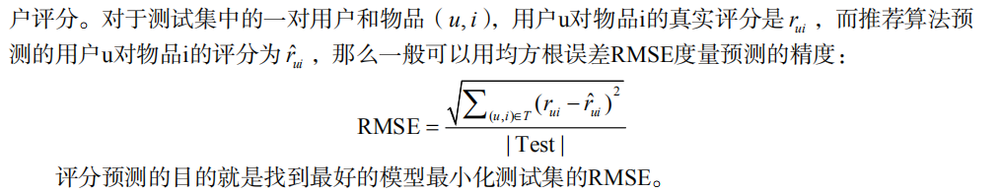
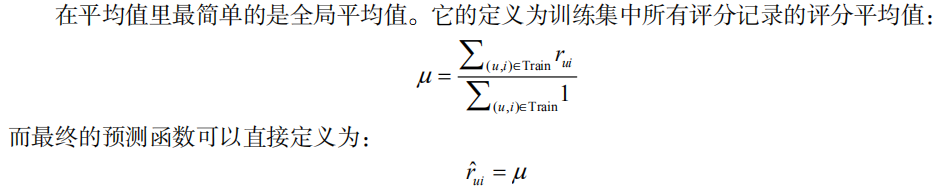
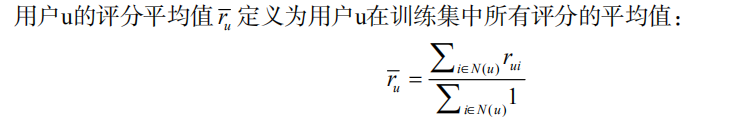
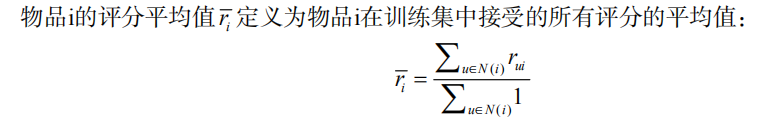
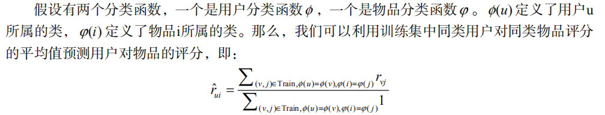
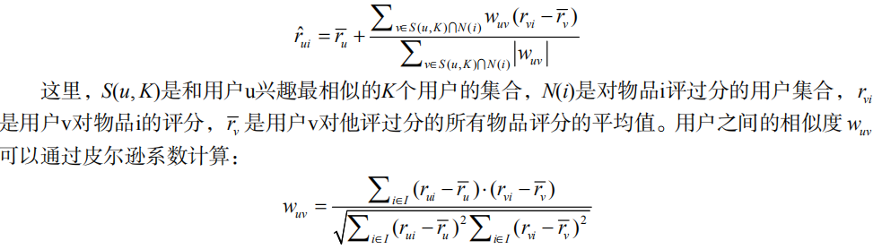
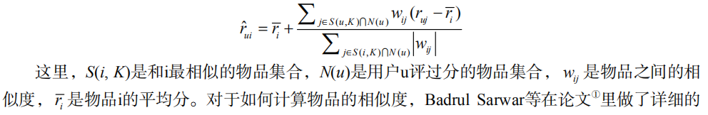

# 评分预测问题

  - 评分预测问题最基本的数据集就是用户评分数据集。该数据集由用户评分记录组成，每一条评分记录是一个三元组(u, i, r)，表示用户u给物品i赋予了评分r。
  
## 8.1 离线实验方法

  - 评测方法：
  
  
## 8.2 评分预测算法

### 8.2.1 平均值

  - 全局平均值
  
  
  - 用户评分平均值
  
  
  - 物品评分平均值
  
  
  - 用户分类对物品分类的平均值
  
  
## 8.2.2 基于邻域的方法

  - 基于用户的邻域算法认为预测一个用户对一个物品的评分，需要参考和这个用户兴趣相似的用户对该物品的评分。
  
  
  - 基于物品的邻域算法在预测用户u对物品i的评分时，会参考用户u对和物品i相似的其他物品的评分。
  
  
### 8.2.3 隐语义模型与矩阵分解模型

  
