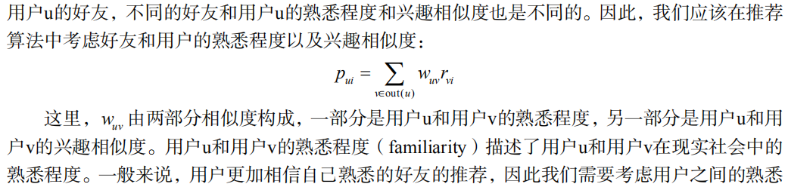
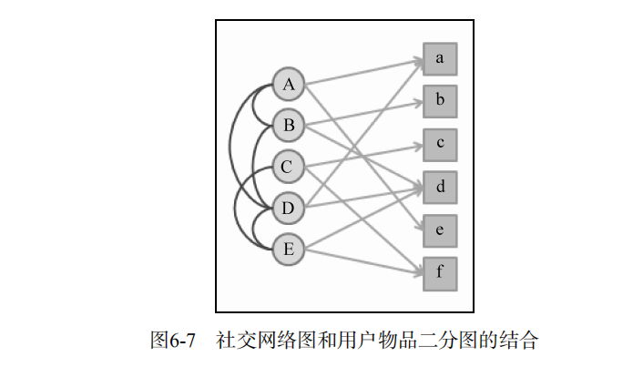

# 利用社交网络数据

## 6.1 获取社交网络数据的途径

  - 电子邮件：正是由于电子邮件系统包含了用户的大量社交信息，很多社交网站都在用户注册时提供了让用户从电子邮件联系人中导入好友关系的功能，用以解决社交网络的冷起动问题。
  - 用户注册信息
  - 用户的位置数据：在网页上最容易拿到的用户位置信息就是IP地址。对于手机等移动设备，我们可以拿到更详细的GPS数据。
  - 论坛和讨论组
  - 即时聊天工具：和电子邮件系统一样，用户在即时聊天工具上也会有一个联系人列表，而且往往还会给联系人进行分组。通过这个列表和分组信息，我们就可以知道用户的社交网络关系，而通过统计用户
之间聊天的频繁程度，可以度量出用户之间的熟悉程度。
  - 社交网站：Facebook和Twitter作为社交网站中的两个代表，它们其实代表了不同的社交网络结构。在Facebook里，人们的好友一般都是自己在现实社会中认识的人，比如亲戚、同学、同事等，
  而且Facebook中的好友关系是需要双方确认的。在Twitter里，人们的好友往往都是现实中自己不认识的，而只是出于对对方言论的兴趣而建立好友关系，好友关系也是单向的关注关系。
  Facebook为代表的社交网络称为社交图谱（social graph），而以Twitter为代表的社交网络称为兴趣图谱（interest graph）。
  
## 6.2 社交网络数据简介

  - 一般来说，有3种不同的社交网络数据：
    - 双向确认的社交网络数据：用户A和B之间形成好友关系需要通过双方的确认。因此，这种社交网络一般可以通过无向图表示。
    - 单向关注的社交网络数据：用户A可以关注用户B而不需要得到用户B的允许，因此这种社交网络中的用户关系是单向的，可以通过有向图表示。
    - 基于社区的社交网络数据：用户之间并没有明确的关系，但是这种数据包含了用户属于不同社区的数据。属于同一个小组可能代表了用户兴趣的相似性。
    
## 6.3 基于社交网络的推荐

  - 社会化推荐优点：
    - 好友推荐可以增加推荐的信任度
    - 社交网络可以解决冷启动问题
  - 社会化推荐缺点：
    - 并不一定能提高推荐算法的离线精度（准确率和召回率）。特别是在基于社交图谱数据的推荐系统中，因为用户的好友关系不是基于共同兴趣产生的，所以用户好友的兴趣往往和用户的兴趣并不一致。

### 6.3.1 基于邻域的社会化推荐算法

  - 如果给定一个社交网络和一份用户行为数据集。其中社交网络定义了用户之间的好友关系，而用户行为数据集定义了不同用户的历史行为和兴趣数据。
  - 考虑好友和用户的熟悉程度以及兴趣相似度：
  
  
### 6.3.2 基于图的社会化推荐算法

  - 社交网络图模型：
  
  
### 6.3.3 实际系统中的社会化推荐算法
  
  
